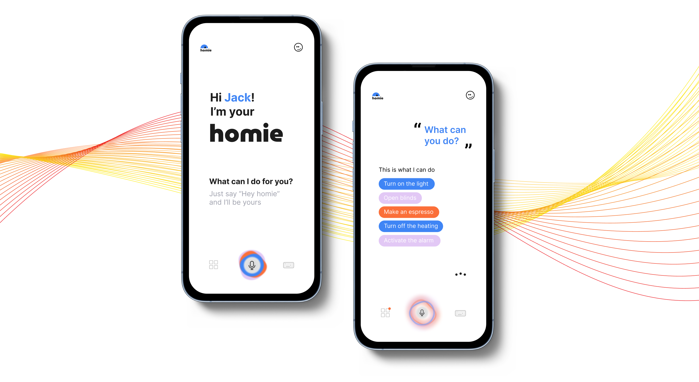

# 💡 Homie: a smart conversational agent

In the last few years smart appliances have become part of our life, our house has become smarter and always connected.
However, the interaction with those devices is still difficult because of the different kind of interfaces and not
always interoperable. Homie helps users to interact with all smart-home appliances



This project was born in 2022 in the framework of the PhD course "Human AI Interaction" at Politecnico di Torino. This
repository contains the Python code based on the [dialogflow-weather](https://github.com/luigidr/dialogflow-weather)
example.

It uses the Web Speech API (experimental) for speech-to-text and text-to-speech operations. For Natural Language
Processing, it uses [Dialogflow ES](https://dialogflow.cloud.google.com) agent, included as a `.zip` file.

Tested in Chrome 57+, Firefox 70+, and Safari 10.1+. Please, notice that speech-to-text capability does not work in
Safari and Firefox.

To get started with the project, import the `homie.zip` into Dialogflow, generate a _service key_ from Google (in JSON),
and download it into the root of the project as `homie-key.json`.

# ▶ Usage
In order to test the app, just run the flask server (you need to install the requirements) via
```
python app.py
```

# 👥 Contributors
* [Roberto Chiosa](https://github.com/RobertoChiosa)
* Sofia Cretaio
* [Simone Monaco](https://github.com/simone7monaco)
* [Lorenzo Vaiani](https://github.com/VaianiLorenzo)
